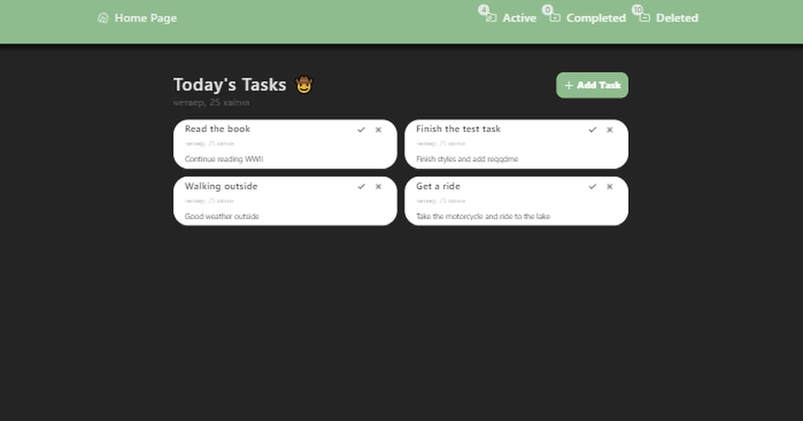

# Todo Raccoon App as test task 📚 👨‍💻

### [GO TO LIVE DEMO PAGE HERE ](https://todo-raccoon.onrender.com/) 👀

Todo Raccoon App is single page application.

Project structure:

- TaskForm;
- TaskList;
- TaskModal;
- Navigating through pages by task's status: Active, Completed, Deleted. The main page displays all tasks except those marked as deleted;

- **Project name**: Todo Raccoon App
- **Project goals - create a component that meets the requirements below**:
  - Adding a new record.
  - A new record is added if its length is less than or equal to N characters.
  - Display a list of added records.
  - Switching the status of a record Completed / Not completed when clicking on
    its name.
  - Navigating through pages by type (all, completed, current).
  - Display counter of active, completed and deleted tasks.
  - Use a storage (Redux Toolkit and Redux Persist).
  - For styling used CSS and SASS.

##

##

## Installation and Usage ⚙️ 🚀

To get start application, follow these steps:

1. **Clone the repository**: Use the `git clone` command to clone this
   repository to your computer.
2. **Install the dependencies**: Open a terminal in the root of the project and
   run `npm install` or `yarn install` to install all required dependencies.
3. **Run the application**: Run the `npm run dev` or `yarn dev` command to run
   the project on the local server. ``

## The web application using the following technologies and libraries: ⚙️🖥️

- JavaScript,
- TypeScript,
- React.js,
- Redux Toolkit,
- React Router,
- CSS, SASS,
- React Hook Form,
- React-hot-toast

## Stay in touch 🤠 💼

- Author - [Oleksandr Podoliako](https://github.com/BlackyHat)
- Linkedin -
  [http://linkedin.com/in/oleksandr-vp](http://linkedin.com/in/oleksandr-vp)
- Telegram - [@blackhatty](https://t.me/blackhatty)
